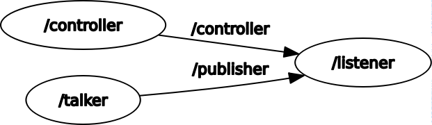

# Homework 1 - Corso di Laboratorio Ciberfisico

Primo esercizio per il Corso di Laboratorio Ciberfisico, Modulo di Robot Programming with ROS, Università di Verona.

Si tratta di un package per il sistema operativo ROS, scritto in Python. La consegna dell'esercizio è reperibile a [questo indirizzo](http://profs.scienze.univr.it/~bloisi/corsi/homework/homework-1.pdf).

## Descrizione

Il progetto è formato da 3 nodi:
1. **talker** si occupa di pubblicare sul topic `publisher` ogni secondo le informazioni relative agli studenti
2. **controller** gestisce l'interazione con l'utente, legge da tastiera un carattere alla volta e, se corrisponde ad un comando valido, esso viene pubblicato sul topic `controller`
3. **listener** rimane in ascolto in entrambi i topic e stampa su console i dati richiesti

I comandi accettati dal sistema sono:
- `'a'` visualizza tutte le informazioni disponibili
- `'n'` visualizza il nome dello studente
- `'e'` visualizza l'età dello studente
- `'c'` visualizza il corso di laurea che lo studente frequenta
- `Ctrl`+`C` termina il programma

## Prerequisiti

Per eseguire questo package è necessario aver installato ROS (progetto sviluppato su ROS versione kinetic kame) ed aver creato un workspace. Il programma viene eseguito con l'interprete Python 2.7 ed utilizza dei moduli esterni da installare separatamente (`readchar`)

## Installazione

È sufficiente scaricare il package nella cartella `src` del workspace ed eseguire il comando `catkin_make`.

## Avvio del programma

L'avvio dell'intero programma viene semplificato grazie ad un file launcher (`homework1.launch`) che avvia automaticamente tutti i nodi necessari nell'ordine corretto e su un unico terminale.
```
roslaunch homework1 homework1.launch
```

#### Avvio manuale dei singoli nodi

In alternativa all'avvio tramite launcher, è possibile avviare manualmente i nodi necessari:

1. Avvio del nodo **rosout**
```
roscore
```
2. Avvio del nodo **talker**
```
rosrun homework1 talker.py
```
3. Avvio del nodo **controller**
```
rosrun homework1 controller.py
```
4. Avvio del nodo **listener**
```
rosrun homework1 listener.py
```

## Schema di funzionamento



Grafico rappresentativo dell'interazione tra i nodi.

## Autori

* **Andrea Benini** - [BAnd313](https://github.com/BAnd313)

## Licenza

Software distribuito sotto licenza GNU LGPLv3. Vedi `LICENSE` per ulteriori informazioni.
